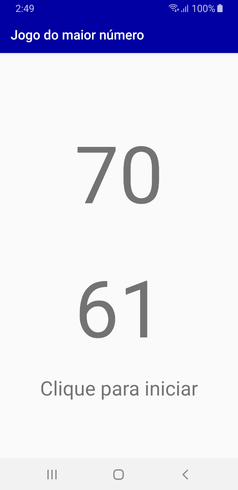
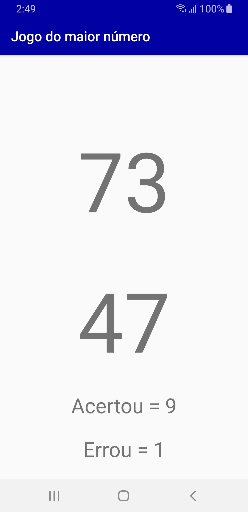

# Exemplo Jogo Maior Valor
Exemplo de um jogo onde o usuário clica no valor e é exibido na tela se a resposta está certa ou errada. Após dez jogadas é exibido o número de acertos e erros.

 

### Licença
Este repositório está disponível sob a licença [Mozilla Public License, version 2.0](https://github.com/jhonatasrm/exemplo-jogo-maior-valor/blob/master/LICENSE)
